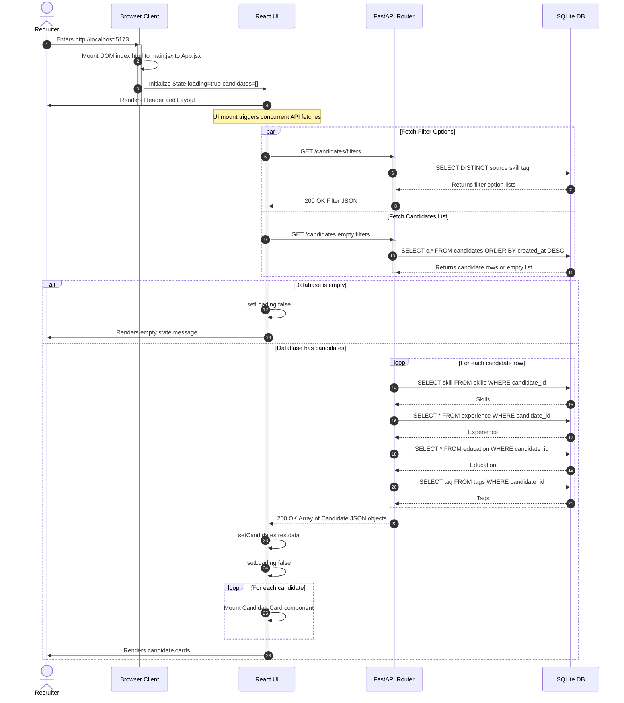
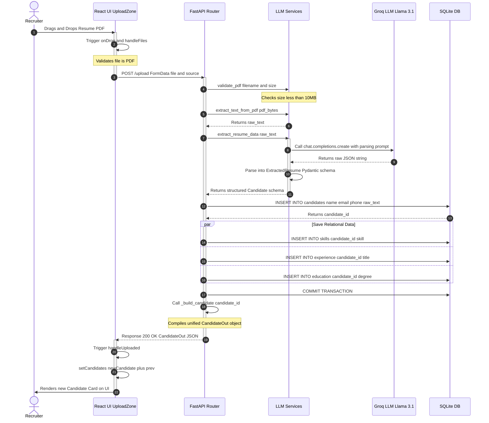
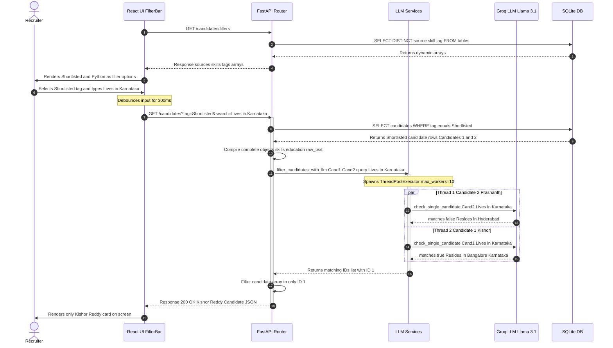
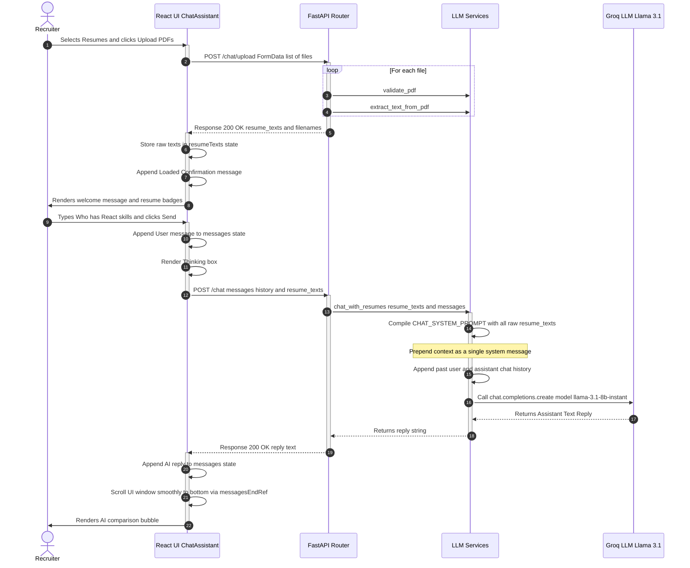

# ResumeIQ Low-Level Design (LLD) Sequence Diagrams

This document contains the complete set of interactive Mermaid sequence diagrams representing the key visual and data transaction flows of the **ResumeIQ** application.

---

## 1. Initial Page Load Flow

This diagram illustrates what happens when the application is launched for the first time. It covers both **Case A (Fresh State / Database is empty)** and **Case B (Populated State / Database has existing records)** in a unified timeline.

---

## 2. Resume PDF Upload & Structured Extraction Flow

This diagram maps out the visual and data transaction that takes place when a recruiter drops a PDF resume to upload it into the main directory.

---

## 3. Dynamic Filtering & AI Search Flow

This diagram illustrates how a user loads dynamic filters, clicks a tag, types a natural language search query, and triggers the combined SQLite & concurrent LLM evaluation pipeline.

---

## 4. Resume Chat Assistant Session Flow

This diagram maps out the session-based chat assistant flow, including parsing PDFs strictly for the current tab memory and building conversational RAG context history.

